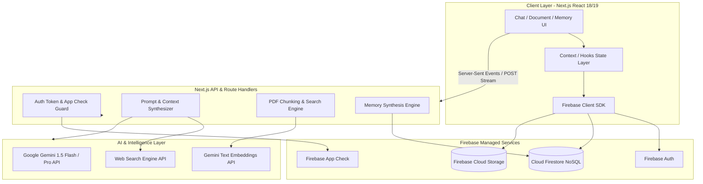
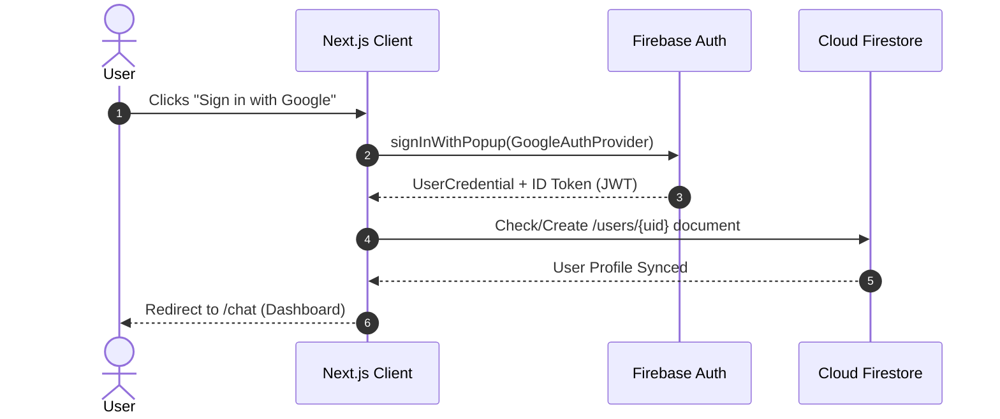
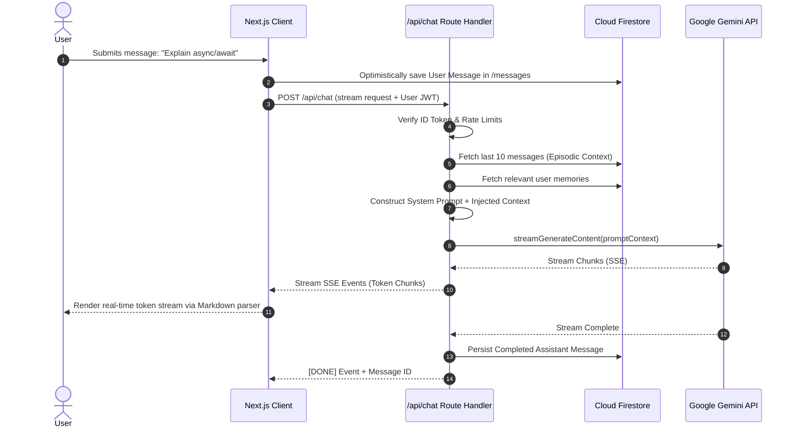
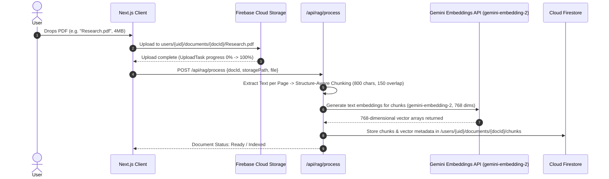
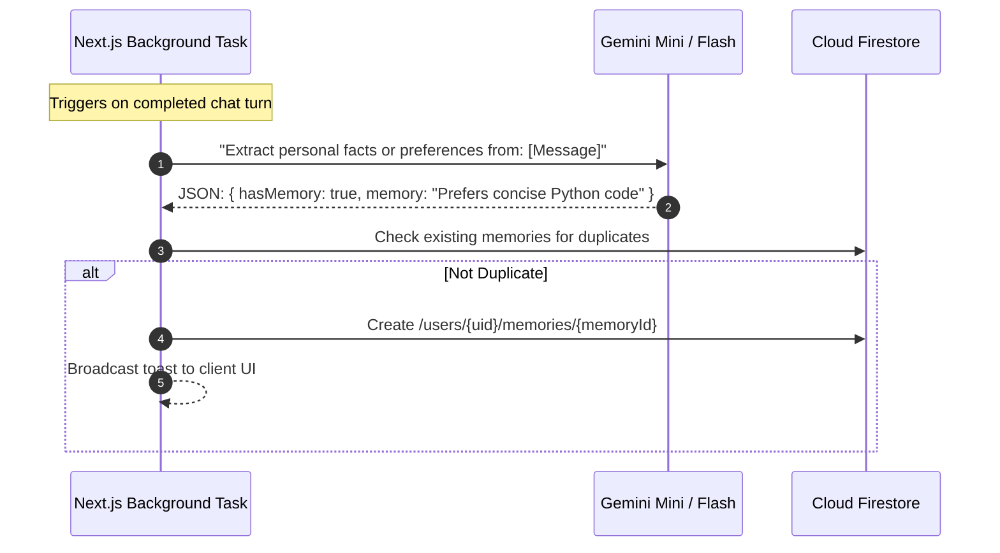
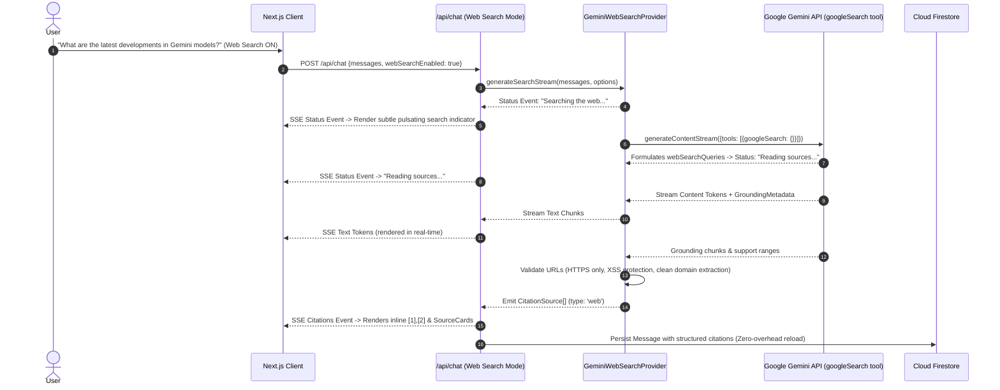

# System Architecture Specification — Cognix

**Document Version:** 1.0.0  
**Lead Software Architect:** Lead AI Engineer & Software Architect  
**Target Platform:** Next.js (App Router), TypeScript, Firebase, Google Gemini  

---

## 1. High-Level System Architecture

Cognix utilizes a hybrid architecture pairing a high-performance **Next.js Web Application** with **Firebase Serverless Cloud Services** and the **Google Gemini Generative AI Platform**.



---

## 2. Frontend Architectural Layers

### 2.1 Architecture Strategy
- **Framework**: Next.js 14+ App Router.
- **Rendering Strategy**: React Server Components (RSC) for initial shell, layout, and static landing components; Client Components (`"use client"`) for stateful chat sessions, streaming message loops, and drag-and-drop file uploaders.
- **State Management**:
  - `AuthContext`: Tracks authenticated user profile, token lifecycle, and session state.
  - `ChatContext`: Manages active conversation thread, message buffer, streaming tokens, and generation abort controllers (`AbortController`).
  - `DocumentContext`: Manages uploaded PDF metadata, parsing progress, and active document focus.
  - `MemoryContext`: Manages long-term memory list, real-time Firestore sync, and toggle states.

### 2.2 Feature-Driven Codebase Organization
```text
src/
├── app/                        # Next.js App Router (pages & endpoints)
│   ├── (auth)/login/           # Login / Signup routes
│   ├── (dashboard)/chat/       # Active chat & conversation views
│   ├── api/chat/route.ts       # Streaming Gemini proxy & RAG pipeline
│   ├── api/rag/route.ts        # PDF parsing and embedding endpoint
│   ├── api/search/route.ts     # Web search retrieval endpoint
│   └── layout.tsx              # Root layout with theme & auth providers
├── components/                 # Shared atomic UI primitives (Buttons, Modals, Inputs)
├── features/                   # Encapsulated domain feature modules
│   ├── auth/                   # Auth forms, Google OAuth button
│   ├── chat/                   # MessageList, MessageItem, ChatInput, CodeBlock
│   ├── documents/              # DocUploader, DocList, PDFPreviewModal
│   ├── memory/                 # MemoryManager, MemoryItemCard, MemoryToggle
│   └── web-search/             # SearchToggle, SourceCitationPopover
├── lib/                        # Infrastructure and third-party SDK clients
│   ├── firebase/               # Client SDK initialization & Firestore helpers
│   ├── gemini/                 # Gemini API client, system prompts, token counters
│   └── utils/                  # String helpers, date formatters, math renderers
├── hooks/                      # Custom hooks (useChatStream, useFirestoreQuery)
└── types/                      # TypeScript definitions (schema, models, API contracts)
```

---

## 3. Backend & API Route Architecture

To maintain strict zero-trust security, **all LLM interactions and search queries route through server-side Route Handlers** (`src/app/api/*`). The client never accesses the raw Gemini API key directly.

```text
POST /api/chat
Headers:
  Authorization: Bearer <Firebase_ID_Token>
  X-Firebase-AppCheck: <AppCheck_Token>
Body:
  {
    conversationId: string,
    message: string,
    documentIds?: string[],
    webSearchEnabled?: boolean
  }
Response:
  ReadableStream (Server-Sent Events: text/event-stream)
```

---

## 4. Detailed Data Flows & Sequence Diagrams

### 4.1 Authentication Flow


---

### 4.2 Streaming Chat Data Flow


---

### 4.3 Document Intelligence (RAG) Pipeline


---

### 4.4 Long-Term Memory Synthesis & Retrieval


---

### 4.5 Grounded Web Search Flow (Gemini Google Search Grounding)


---

## 5. Security Boundaries & Zero-Trust Architecture

| Boundary | Enforcement Mechanism | Failure Action |
| :--- | :--- | :--- |
| **API Key Protection** | Gemini and Search API keys loaded solely in Node.js server environment (`process.env.GEMINI_API_KEY`). | Keys never shipped in client bundle. |
| **User Data Isolation** | Firestore & Storage security rules validate `request.auth.uid == resource.data.userId`. | `PERMISSION_DENIED` (403) returned if attempting cross-user reads/writes. |
| **Client Attestation** | Firebase App Check with reCAPTCHA Enterprise / Play Integrity. | Rejects automated bots and unofficial client requests. |
| **File Validation** | Magic number / MIME type verification on upload; 10MB size limit cap. | Immediate reject with `INVALID_FILE_TYPE`. |
| **Prompt Sanitization** | Strict delimiter isolation between user instructions and external retrieved content to prevent prompt injection. | Grounding sandboxing applied. |

---

## 6. Scalability & Performance Strategy

1. **Context Trimming**: Smart sliding window keeps only the last $N$ turns in the immediate prompt, preventing token bloat and reducing API latency.
2. **Stream Direct-Piping**: Responses from Gemini are piped as raw Node `ReadableStream` chunks directly into standard Web Streams to avoid buffering large texts in server memory.
3. **Database Indexing**: Compound Firestore indexes pre-defined for querying chat messages ordered by `createdAt DESC` filtered by `conversationId`.
