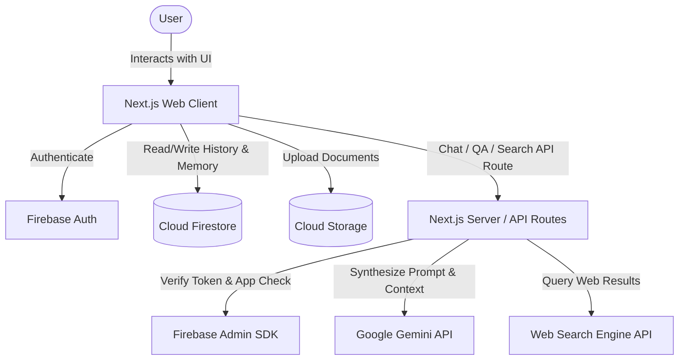

# Product Requirements Document (PRD) — Cognix

**Document Version:** 1.0.0  
**Status:** Approved for Foundation  
**Product Lead / Architect:** Lead Product Architect & AI Engineer  
**Target Release:** V1 MVP  

---

## 1. Executive Summary & Product Vision

**Cognix** is a free, intelligent, general-purpose AI assistant designed to provide users with a clean, calm, and highly capable AI workspace. While mainstream AI chatbots frequently overwhelm users with bloated interfaces, aggressive monetisation paywalls, or fragmented tools, Cognix delivers a unified, premium experience combining:

1. **Fluid conversational AI** powered by Google Gemini.
2. **Document intelligence (RAG)** for PDFs and structured texts.
3. **Real-time grounded web search** with transparent source attribution.
4. **Persistent cross-session long-term memory** with full user sovereignty.
5. **Secure multi-tenant data isolation** powered by Firebase.

Cognix is built to feel **professional, friendly, intelligent, modern, trustworthy, minimal, calm, and helpful**.

---

## 2. Problem Statement & Target Audience

### 2.1 The Problem
- **Context Fragmentation**: Users must jump between separate tools for conversational queries, document analysis, and web search.
- **Amnesic AI Systems**: Most standard chat interfaces forget the user’s background, communication preferences, and ongoing tasks between sessions, requiring repeated prompting.
- **Unverified AI Hallucinations**: Standard models fabricate facts or pretend to know real-time events without verifiable citations.
- **Intrusive Complexity & Clutter**: Many AI tools are either too barebones (like raw API playgrounds) or overly complex and corporate.

### 2.2 Target Users & Personas

| Persona | Description | Primary Needs from Cognix |
| :--- | :--- | :--- |
| **The Student / Learner** | University or high school students studying diverse subjects. | Explaining complex concepts, summarizing lecture notes/PDFs, solving coding/math problems, generating study flashcards. |
| **The Software Developer** | Frontend, backend, and full-stack engineers. | Debugging code, writing boilerplate, explaining architectural trade-offs, code reviews, formatting markdown code blocks. |
| **The Knowledge Worker / Researcher** | Writers, analysts, consultants, and professionals. | Reviewing multi-page whitepapers, extracting citations, summarizing reports, drafting professional correspondence. |
| **The General Everyday User** | Individuals looking for a personal daily assistant. | Quick fact-checking, creative writing, meal planning, learning new topics, conversational companion. |

---

## 3. Goals & Non-Goals

### 3.1 Goals (V1 Scope)
- Deliver sub-second Time to First Token (TTFT) for conversational streaming chat.
- Allow users to upload PDF documents (up to 10MB) and ask contextually grounded questions.
- Provide real-time web search capabilities with clickable citations whenever fresh information is requested.
- Extract and store high-value user preferences/facts in a transparent Long-Term Memory store.
- Enable users to manage their chat history (create, rename, search, delete threads).
- Ensure 100% data isolation per user with Firebase Authentication and Firestore security rules.
- Maintain responsive, accessible (WCAG 2.1 AA) UI across desktop, tablet, and mobile.

### 3.2 Non-Goals (Out of Scope for V1)
- **Direct Voice/Speech-to-Speech synthesis** (Scheduled for V1.1 / Future).
- **Automated Agentic Tool Execution** (e.g. executing arbitrary Python code on remote servers, booking flights).
- **Multi-user collaborative chat rooms** (V1 is strictly single-user private conversations).
- **Proprietary fine-tuned model hosting** (Cognix leverages Google Gemini API endpoints).
- **Paid tiers / billing integration** (Cognix V1 is entirely free for users).

---

## 4. User Stories & Acceptance Criteria

### US-1: Conversational Chat with Streaming & Rich Markdown
- **As a** user,
- **I want to** type messages and receive fast, streaming responses from Gemini,
- **So that** I experience a responsive and dynamic conversation.
- **Acceptance Criteria:**
  - Streaming begins within 1.2s on normal broadband.
  - Markdown elements (headers, bold/italics, lists, tables, blockquotes, inline math) render accurately.
  - Fenced code blocks include language badges and one-click "Copy Code" buttons.
  - Users can click "Stop Generation" to abort streaming mid-flight.
  - Users can click "Regenerate" to request an alternative response from the model.

### US-2: Document Intelligence (PDF Upload & Grounded QA)
- **As a** student or researcher,
- **I want to** upload a PDF file and ask questions about its content,
- **So that** I can extract insights without reading the entire document manually.
- **Acceptance Criteria:**
  - Upload accepts PDF files up to 10MB (MIME validated on client and server).
  - The UI displays an upload progress bar and an active document chip in the chat context.
  - AI responses cite specific sections or page references from the uploaded PDF.
  - Uploaded files are securely stored in Firebase Cloud Storage under `users/{userId}/documents/`.

### US-3: Real-Time Grounded Web Search
- **As a** knowledge worker,
- **I want to** ask questions about recent events or facts requiring live data,
- **So that** Cognix provides accurate, verified information with web citations.
- **Acceptance Criteria:**
  - Cognix triggers web search when temporal queries or specific fact-checking is detected.
  - Responses include numbered inline citations (`[1]`, `[2]`) linked to verified sources.
  - A collapsible "Sources" accordion lists page titles, URLs, and snippets.
  - Under no circumstances are fake or hallucinated URLs displayed.

### US-4: Long-Term Memory Synthesis & Sovereignty
- **As a** frequent user,
- **I want** Cognix to remember key details about me (e.g., programming language preference, profession),
- **So that** I don't have to repeat myself in every new conversation.
- **Acceptance Criteria:**
  - Important user facts/preferences are extracted asynchronously and stored in the `memories` collection.
  - Users can view all saved memories in a dedicated "Memory Management" settings tab.
  - Users can delete specific memories, edit memory entries, or disable the memory system entirely.
  - Raw conversation logs are never dumped blindly into the memory bank.

### US-5: Secure User Authentication & Chat Session Management
- **As a** privacy-conscious user,
- **I want to** sign in via Email/Password or Google and access my private chat history,
- **So that** my data is preserved and accessible across my devices.
- **Acceptance Criteria:**
  - Firebase Authentication handles Email/Password sign up/login and Google OAuth popup.
  - Unauthenticated users cannot read or write any user data.
  - Left sidebar lists previous conversations grouped by date (Today, Yesterday, Previous 7 Days, Older).
  - Users can rename or permanently delete any conversation thread.

---

## 5. Functional Requirements Specification

### 5.1 Chat Management Module
- **FR-1.1**: New conversation creation initialized with an auto-generated title or default "New Chat".
- **FR-1.2**: Auto-titling: After the first user-assistant turn, a lightweight background LLM call summarizes the topic into a 3-5 word title.
- **FR-1.3**: Message history retrieval ordered by timestamp ascending with pagination/virtualization support.
- **FR-1.4**: Token context window trimming: History is truncated or summarized if conversation history exceeds the Gemini context budget.

### 5.2 Document Intelligence Module (RAG)
- **FR-2.1**: PDF parsing and text extraction using PDF parser utilities on serverless route handlers.
- **FR-2.2**: Chunking strategy: 800-1000 character chunks with 150 character sliding overlap.
- **FR-2.3**: Context retrieval: High-similarity chunks selected via vector embeddings or BM25/cosine similarity and appended to the prompt system context.
- **FR-2.4**: Multi-document handling: Users may attach up to 3 PDF documents per chat session in V1.

### 5.3 Web Search Grounding Module
- **FR-3.1**: Intent classification to determine if query requires external live web retrieval.
- **FR-3.2**: Search query generation: Distilling user prompt into optimized search keywords.
- **FR-3.3**: Retrieval & grounding: Extracting top 3-5 search result snippets and providing them in system context.
- **FR-3.4**: Strict source formatting: Enforcing standardized markdown reference markers with verified URLs.

### 5.4 Long-Term Memory Module
- **FR-4.1**: Extraction heuristics: Memory extraction runs on completed assistant turns when explicit personal preferences, habits, or facts are shared.
- **FR-4.2**: Semantic deduplication: Before adding a new memory, existing memories are compared to avoid duplicate or conflicting records.
- **FR-4.3**: Context injection: Top relevant memories (max 5-10 items) are dynamically injected into the system prompt of active chats.
- **FR-4.4**: Master memory switch: A user setting to globally pause or wipe memory.

### 5.5 User Account & Settings Module
- **FR-5.1**: Profile management (display name, avatar, email).
- **FR-5.2**: Theme toggling (Dark, Light, System).
- **FR-5.3**: Account deletion cascade: Permanently purges user document, chats, messages, files in Storage, and memories.

---

## 6. Non-Functional Requirements (NFR)

### 6.1 Performance
- **Time to First Token (TTFT)**: < 1200ms for conversational queries.
- **Lighthouse Performance Score**: > 90 on desktop and mobile.
- **Client Bundle Size**: First load JS < 150KB gzipped.
- **Document Processing**: PDF parsing and index readiness < 5 seconds for a 5-page document.

### 6.2 Security & Compliance
- **Zero Client Secrets**: All Gemini API keys, Firebase Admin credentials, and Search API keys reside exclusively on the server.
- **Granular Security Rules**: Firestore and Storage rules strictly validate `request.auth.uid == resource.data.userId`.
- **App Check**: Enabled to prevent API scraping and unauthorized direct backend calls.
- **Data Protection**: Zero training on user private chats or documents.

### 6.3 Usability & Accessibility
- **WCAG Compliance**: Compliant with WCAG 2.1 AA standards (color contrast ratio >= 4.5:1 for normal text).
- **Full Keyboard Navigation**: All actions (send message, navigate sidebar, open settings) operable via keyboard shortcuts.
- **Screen Reader Support**: ARIA attributes on dynamic streaming text, alerts, and modal dialogs.

### 6.4 Reliability & Availability
- **Graceful Degradation**: Clear visual fallbacks when offline or when third-party APIs encounter outages.
- **Retry Mechanics**: Exponential backoff with jitter on transient Gemini API 429/503 errors.

---

## 7. Release Scope Matrix

| Feature Area | V1 (MVP) | V1.1 (Enhancement) | Future (Long-Term) |
| :--- | :--- | :--- | :--- |
| **Authentication** | Email/Password + Google OAuth | GitHub OAuth + Magic Link | Passkeys / WebAuthn |
| **Chat Interaction** | Gemini 1.5 Flash/Pro Streaming, Markdown, Code Copy | Export chat to PDF/MD, Branching conversation | Multi-agent collaboration |
| **Document QA** | PDF upload (up to 10MB), text extraction & QA | DOCX, TXT, CSV support, Page viewer split-screen | Multimodal image/chart extraction |
| **Web Search** | Grounded search with citations | Domain filtering, date-range search controls | Real-time browser agent automation |
| **Memory System** | Explicit preference extraction & manual CRUD | Memory categories (Work, Personal, Tech) | Vector-driven deep memory graph |
| **Platform** | Responsive Web App | PWA with offline view | Native Desktop / Mobile Apps |

---

## 8. Success Metrics (KPIs)

1. **User Retention**: > 40% weekly active user (WAU) return rate.
2. **Conversation Completion Rate**: > 95% of initiated chat turns successfully stream to completion without client-side error.
3. **Response Satisfaction**: User feedback (thumbs up / thumbs down ratio) > 85% positive.
4. **Document QA Precision**: High fidelity responses with zero hallucinated document citations.
5. **Memory Precision**: > 90% of extracted memories confirmed accurate upon user inspection.

---

## 9. Unresolved Decisions & Open Points

> [!NOTE]
> - `DECISION NEEDED`: Choose primary Search API provider for V1 (Google Custom Search API vs Tavily API vs Serper API). Tavily is recommended for LLM-optimized RAG snippets.
> - `DECISION NEEDED`: Determine client-side PDF text extraction (e.g. `pdfjs-dist`) vs server-side extraction for optimal performance and memory footprint.
