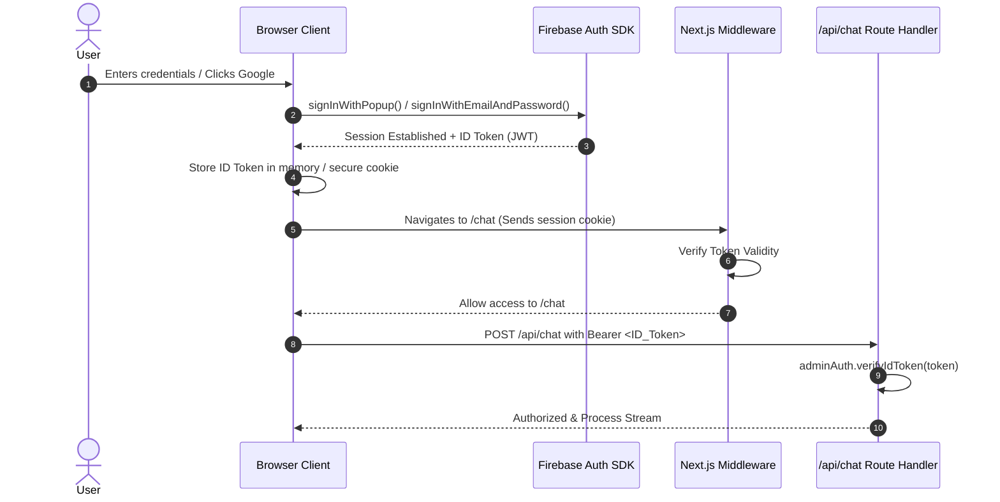

# Authentication Architecture & Session Lifecycle — Cognix

**Document Version:** 1.0.0  
**Backend Lead:** Lead Backend & Security Architect  

---

## 1. Authentication Methods (V1 Scope)

Cognix uses **Firebase Authentication** to manage user identities securely:

1. **Email / Password**:
   - Client-side validation: Valid email format, password minimum 8 characters with alphanumeric requirements.
   - Verification emails enabled for account security.
2. **Google OAuth (Federated Provider)**:
   - One-click sign-in via `GoogleAuthProvider` popup or redirect.
   - Seamless onboarding with user profile picture and display name pre-populated.

---

## 2. Session Lifecycle & Token Management



### 2.1 Token Refresh Strategy
- Firebase Auth automatically refreshes ID tokens before their 1-hour expiration.
- Real-time client state is managed via the `onAuthStateChanged` listener in `AuthContext`.

---

## 3. Next.js Route Protection Strategy

Protected routes (`/chat`, `/documents`, `/settings`, `/api/*`) are guarded at both the middleware and route handler levels:

### 3.1 Next.js Middleware Pattern (`src/middleware.ts`)
```typescript
import { NextResponse } from 'next/server';
import type { NextRequest } from 'next/server';

export function middleware(request: NextRequest) {
  const sessionToken = request.cookies.get('__session')?.value;
  const isAuthRoute = request.nextUrl.pathname.startsWith('/login') || 
                      request.nextUrl.pathname.startsWith('/signup');
  const isDashboardRoute = request.nextUrl.pathname.startsWith('/chat') ||
                           request.nextUrl.pathname.startsWith('/settings');

  if (isDashboardRoute && !sessionToken) {
    return NextResponse.redirect(new URL('/login', request.url));
  }

  if (isAuthRoute && sessionToken) {
    return NextResponse.redirect(new URL('/chat', request.url));
  }

  return NextResponse.next();
}

export const config = {
  matcher: ['/chat/:path*', '/settings/:path*', '/login', '/signup'],
};
```

---

## 4. Account Deletion & GDPR Data Purge

When a user requests account deletion (`DELETE /api/user/account`):
1. **Verify Authentication**: Confirms caller's UID matches target user.
2. **Purge Firestore Data**: Deletes `/users/{uid}`, all subcollection memories, all `/conversations` and messages belonging to the user, and all `/documents` records.
3. **Purge Cloud Storage Files**: Deletes all blobs in `gs://<bucket>/users/{uid}/`.
4. **Delete Auth Account**: Calls `adminAuth.deleteUser(uid)`.
5. **Clear Client Session**: Signs out and clears browser cookies.
