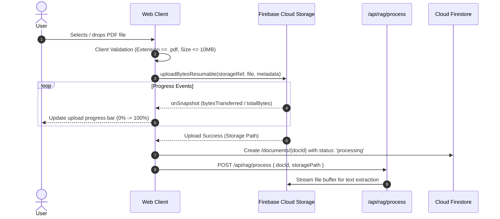

# Firebase Cloud Storage Architecture & Policies — Cognix

**Document Version:** 1.0.0  
**Backend Lead:** Lead Backend & Cloud Architect  

---

## 1. Storage Bucket Organization & Hierarchy

All user-uploaded assets in Cognix are strictly organized within a scoped, tenant-isolated folder hierarchy:

```text
gs://<storage-bucket>/
└── users/
    └── {userId}/
        ├── documents/
        │   └── {documentId}/
        │       └── {sanitizedFileName}.pdf
        └── avatars/
            └── profile.jpg
```

---

## 2. File Upload Pipeline & Constraints



### 2.1 Technical Constraints (V1)
- **Maximum File Size**: 10 Megabytes (`10,485,760` bytes).
- **Supported MIME Types**: `application/pdf` exclusively for V1.
- **Filename Sanitization**: Replaces non-alphanumeric characters with underscores (`_`) to prevent path traversal risks.

---

## 3. Storage Security Rules Specification

Storage rules ensure that no user can read, overwrite, or delete another user's files:

```javascript
rules_version = '2';
service firebase.storage {
  match /b/{bucket}/o {
    
    // User Documents
    match /users/{userId}/documents/{documentId}/{fileName} {
      allow read: if request.auth != null && request.auth.uid == userId;
      
      allow write: if request.auth != null 
        && request.auth.uid == userId
        && request.resource.size <= 10 * 1024 * 1024
        && request.resource.contentType == 'application/pdf';
        
      allow delete: if request.auth != null && request.auth.uid == userId;
    }

    // User Profile Avatars
    match /users/{userId}/avatars/{fileName} {
      allow read: if request.auth != null;
      allow write: if request.auth != null 
        && request.auth.uid == userId
        && request.resource.size <= 2 * 1024 * 1024
        && request.resource.contentType.matches('image/(jpeg|png|webp)');
      allow delete: if request.auth != null && request.auth.uid == userId;
    }
  }
}
```

---

## 4. Deletion & Retention Lifecycle

1. **User-Initiated Document Deletion**:
   - Deleting a document from the UI triggers an API endpoint that purges the binary file from Firebase Cloud Storage and deletes the `/documents/{docId}` record and all its chunk subdocuments in Firestore.
2. **Account Deletion Cascade**:
   - When a user deletes their account, a background Firebase Admin script iterates over `users/{userId}/` in Storage and purges all associated files to ensure complete GDPR/CCPA compliance.
