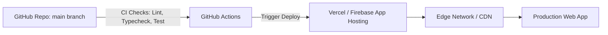

# Production Deployment & Operations — Cognix

**Document Version:** 1.0.0  
**DevOps Lead:** Lead Infrastructure & DevOps Engineer  

---

## 1. Deployment Architecture

Cognix supports zero-downtime continuous deployment via **Vercel** or **Firebase App Hosting**:

---

## 2. Environment Promotion Strategy

| Environment | Purpose | URL / Host | Firebase Project |
| :--- | :--- | :--- | :--- |
| **Local** | Local development with emulators | `localhost:3000` | `cognix-emulator` |
| **Preview** | PR branch previews | `*-cognix.vercel.app` | `cognix-staging` |
| **Production** | Live public production release | `cognix.app` | `cognix-production` |

---

## 3. Build & CI/CD Pipeline (`.github/workflows/ci.yml`)

The continuous integration pipeline enforces three gates before allowing merges to `main`:
1. **Typecheck Gate**: `npm run type-check` (Zero TypeScript compiler errors).
2. **Lint & Format Gate**: `npm run lint` (ESLint + Prettier consistency).
3. **Automated Test Gate**: `npm test` (Unit and Firebase rules tests pass).

---

## 4. Production Secret Configuration

Production secrets are injected securely via the hosting provider dashboard:
- `GEMINI_API_KEY`: High-tier production Gemini API Key.
- `FIREBASE_ADMIN_PRIVATE_KEY`: Service account private key for server-side auth verification.
- `SEARCH_API_KEY`: Dedicated search provider key.

---

## 5. Observability, Health Checks & Monitoring

1. **Synthetic Health Endpoint**: `GET /api/health` returns status `200 OK` if Firebase Admin and Gemini client initialize without errors.
2. **Error Tracking**: Integration with **Sentry** to capture unhandled client exceptions and server route errors.
3. **Performance Monitoring**: Core Web Vitals tracked via Vercel Analytics / Google Analytics 4.
