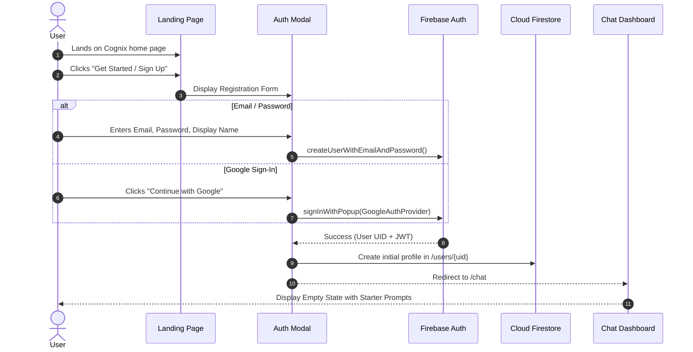
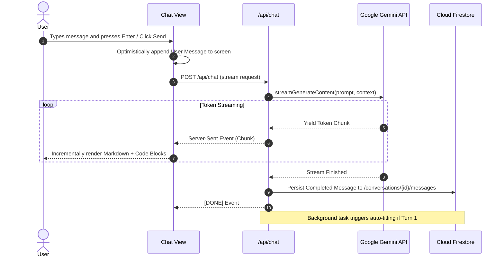
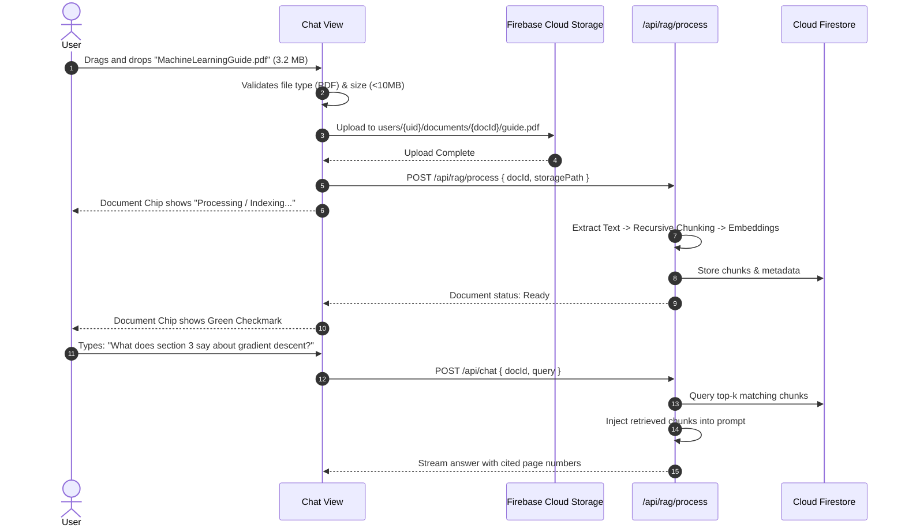
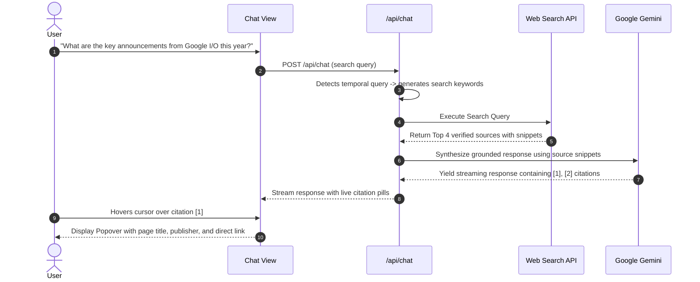
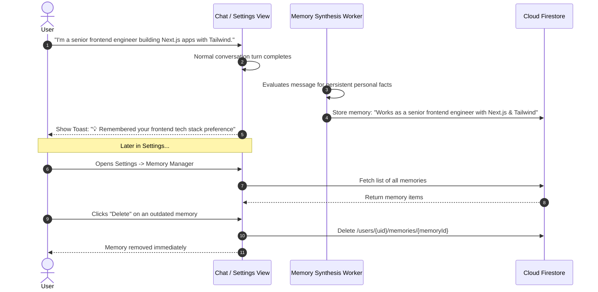
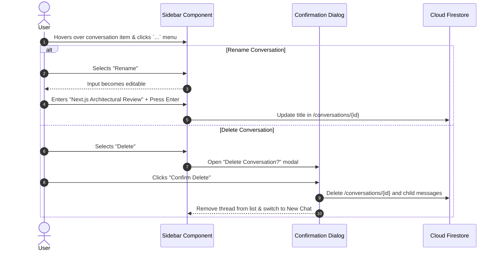

# End-to-End User Flows & Journeys — Cognix

**Document Version:** 1.0.0  
**Lead UX Architect:** Senior UX Strategist  

---

## 1. User Journey 1: New User Onboarding & Registration

---

## 2. User Journey 2: New Conversational Chat & Streaming

---

## 3. User Journey 3: PDF Document Upload & Grounded Question Answering

---

## 4. User Journey 4: Grounded Web Search & Citation Inspection

---

## 5. User Journey 5: Long-Term Memory Creation & Management

---

## 6. User Journey 6: Conversation Thread Management (Rename & Delete)

